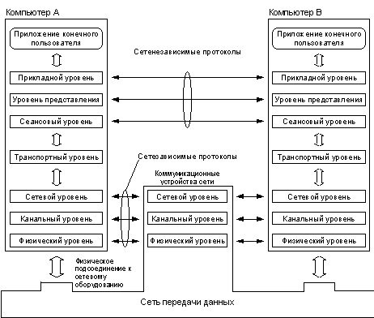
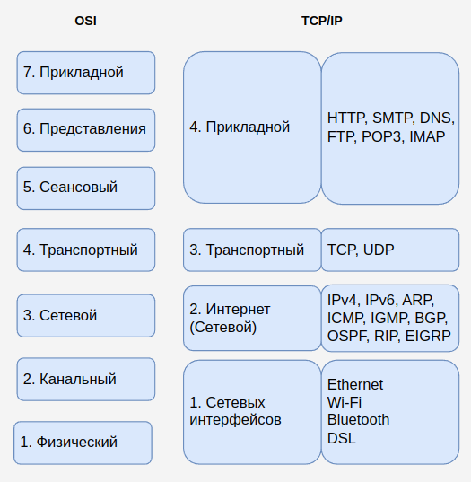
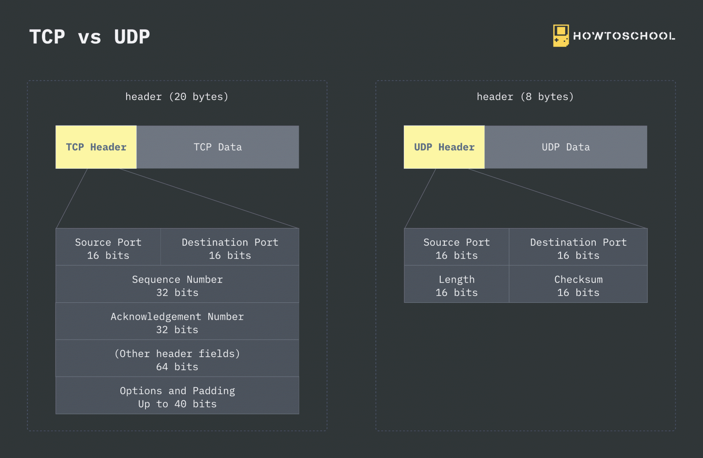
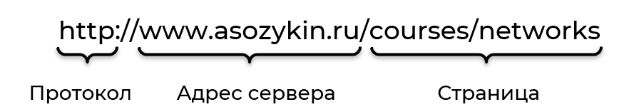
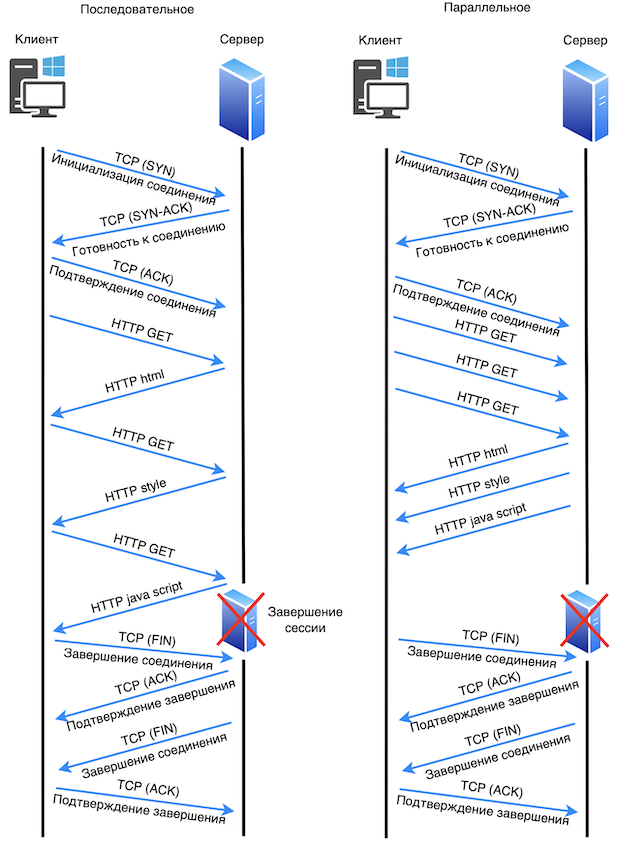
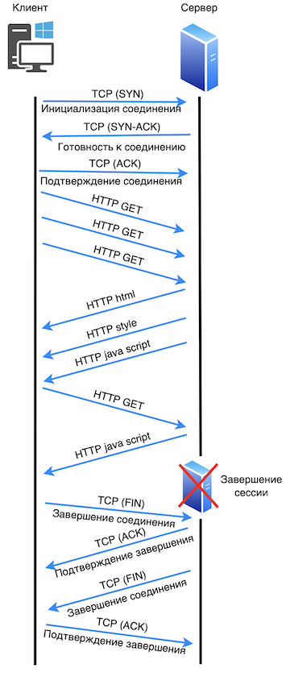
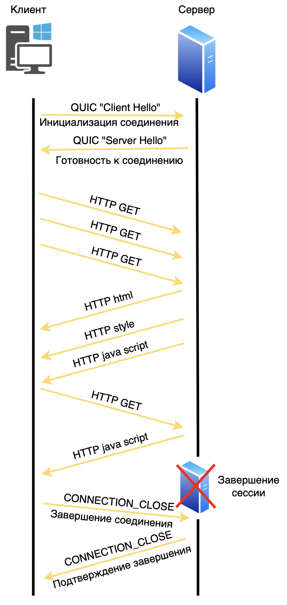
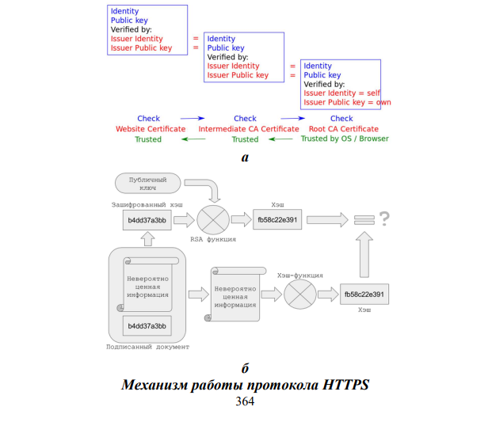
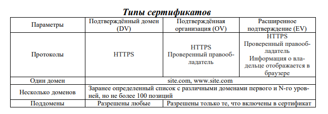

# HTTP/S  
  
***Введение***  
  
Этот проект посвящён ключевым сетевым протоколам и моделям, которые лежат в основе современного интернета. В нём рассматриваются архитектурные принципы взаимодействия систем, начиная с теоретической модели OSI, переходя к практическим протоколам TCP/IP и завершая детальным разбором HTTP и его защищённой версии HTTPS. Особое внимание уделено эволюции протоколов и обеспечению безопасности передачи данных.  
  
***СЕТЕВАЯ МОДЕЛЬ OSI***  
  
Сетевая модель OSI (Open Systems Interconnection model базовая эталонная модель взаимодействия открытых систем, ЭМВОС) представляет собой концептуальную модель, которая характеризует и стандартизирует коммуникационные функции телекоммуникационной или вычислительной системы не зависит от их внутренней структуры и технологии. Его целью является совместимость различных систем связи со стандартными протоколами. Оригинальная версия модели определилась семью слоев. Каждый слой имеет свои свойства, он использует только функции его нижнего слоя, и разрешает только верхнему слою, использует свои функции.  
  
  
  
*Уровень 1:* физический уровень (Physical Layer) – самый нижний уровень, он определяет электрические и физические характеристики соединения данных, связь между устройством и физической среды передачи данных (например, медные или волоконно-оптические кабеля, радиочастота). Физический уровень отвечает за передачу и прием неструктурированных необработанных данных на физической среде. Физический уровень никогда не касаются протоколов или других подобных элементов более высокого уровня. Примеры аппаратных средств на этом слое являются сетевые адаптеры, повторители, сетевые концентраты, модемы и медиаконвертер.  
- Протоколы: IEEE 802.15 (Bluetooth), RS-232, Wi-Fi (802.11).   
  
*Уровень 2:* Канальный уровень (Data Link Layer) обеспечивает связь между двумя напрямую соединенными узлами (node-to-node data transfer). Этот уровень предназначен для обнаружения и исправления ошибок, которые могут возникнуть на физическом уровне. Он определяет протокол для установления и прекращения соединение между двумя физическими подключенными устройствами. Он также определяет протокол для управления потоком данных между ними.   
- Протоколы: Ethernet, PPP, HDLC.  
  
*Уровень 3:* Сетевой уровень (Network Layer) обеспечивает функциональные и процедурные средства передачи блока информации, передаваемый протоколом без предварительного  установления соединения и создания виртуального канала (называется датаграммой) от одного узла к другому подключен к той же сети. Сеть представляет собой среду передачи, к которой может быть подключить много узлов, на которой каждый узел имеет свой адрес и которая разрешает к каким узлам надо подключить, чтобы передать сообщение на назначенные узлы, связанные с сетью, просто предоставляя содержание сообщение и адрес назначенных узлов и позволяя сети найти способ доставки сообщение к узлу назначения.  
- Протоколы: IPv4, IPv6, ICMP, ARP(позволяет преобразовывать MAC-адреса в IP-адреса и обратно).  
  
*Уровень 4:* Транспортный уровень (Transport Layer) обеспечит надёжную передачу информации от отправителя к получателю через одну или несколько сетей, сохраняя при этом качество сервисных функций. Транспортный уровень контролирует надежность данной линии связи с управлением потоком, сегментацией и десегментацией и контролем ошибок. Транспортный уровень также обеспечивает подтверждение передачи данных успешных и посылает следующую информацию, если ошибок не было. Транспортный уровень создает пакеты из сообщения, принятого от прикладного уровня.   
- Протоколы: TCP(обеспечивает точную и надежную доставку данных), UDP(обеспечивает быструю, но ненадежную передачу данных без установки соединения).  
  
*Уровень 5:* Сеансовый уровень (Session Layer) обеспечивает поддержание сеанса связи. Он устанавливает, управляет и завершает соединения между локальными или удаленными приложениями. Он обеспечивает полный дуплекс, полу-дуплекс, или симплекс операции. Сеансовый уровень обычно реализуется в средах приложений, использующие удаленными вызовами процедур.  
- Протоколы: NetBIOS, RPC, SIP.  
  
*Уровень 6:* Уровень представления (Presentation layer) преобразует протоколы и обеспечивает кодирование-декодирование данных. Запросы приложений, полученные с прикладного уровня, на уровне представления преобразуются в формат для передачи по сети, а полученные из сети данные преобразуются в формат приложений.  
- Протоколы: MIME, XDR, ASN.1.  
  
*Уровень 7:* Прикладной уровень (Application Layer) является слой OSI ближе к пользователю, как прикладном уровне пользователи взаимодействуют непосредственно с программным приложением. Функции прикладного уровня, как правило, включают в себя идентификацию коммуникационных партнеров, определение доступности ресурсов и синхронизации связи.  
- Протоколы: HTTP, HTTPS, SSL, TLS, Simple Mail Transfer Protocol (SMTP), File Transfer Protocol (FTP) и Domain Name System (DNS).  
  
Модель OSI является одной из теоретических основ для понимания и разработки сетевых решений и проведения сетевого анализа, но её практическое применение может быть ограничено в зависимости от конкретных требований и условий. Поэтому на данный момент пользуется моделью, которая называется TCP/IP.  
  
  
  
***Основные транспортные протоколы***  
  
***TCP (Transmission Control Protocol)***– это основной протокол передачи данных в компьютерных сетях, который обеспечивает надежную и упорядоченную доставку данных между устройствами. Он является одним из ключевых протоколов в стеке TCP/IP, который широко используется в Интернете и в локальных сетях. Протокол TCP работает на основе установления и управления соединениями между отправителем и получателем данных. Это включает в себя процесс установления соединения, передачу данных и завершение соединения. TCP обеспечивает надежную доставку данных путем управления потоком информации, подтверждения приема данных и автоматической переотправки потерянных пакетов. Это гарантирует, что данные доставляются в нужном порядке и без потерь. Протокол TCP также обладает механизмами контроля потока и перегрузки, которые позволяют ему адаптироваться к изменяющимся условиям сети и предотвращать перегрузку сети, обеспечивая оптимальное использование доступной пропускной способности. Хотя TCP является надежным и широко используемым протоколом для передачи данных в Интернете, он может быть менее эффективным в некоторых случаях из-за своего управления соединением и накладных расходов на установление и поддержание соединения  
  
***UDP (User Datagram Protocol)***- это очень простая абстракция базовой IP-датаграммы. И подобно самому IP, UDP является ненадежным средством. Зеркально отображая сервисные характеристики IP, пакеты, отправленные с помощью UDP, возможно, будут или не будут получены по их целевому месту назначения. Пакеты UDP могут перегруппировываться, дублироваться или теряться. В UDP не существует управления потоком данных или его регулирования. Дискретизация пакетов в UDP является явной: если данные разделены отправителем на два пакета UDP, то получатель должен принять данные с помощью двух отдельных операций чтения.  
UDP предназначен для использования в чрезвычайно простых транзакциях, которые не требуют сеансового контекста. Система доменных имен (DNS, Domain Name System) и Сетевой протокол синхронизации (NTP, Network Time Protocol) являются хорошими примерами приложений, которые используют UDP для поддержки очень эффективной модели транзакций запрос/ответ.  
  
  
  
  
  
***HTTP***  
  
*HTTP (Hypertext Transfer Protocol)* – протокол передачи гипертекстовых документов, т.е. документов, содержащих ссылки на другие документы. Этот протокол предполагает использование передачи между клиентом и сервером. Клиент посылает запрос на сервер, последний его обрабатывает и отправляет ответ, содержащий какую-то информацию. Полученный документ может состоять из нескольких файлов.  
Суть его заключается в том, чтобы осуществить обмен сообщениями по схеме «запрос-ответ», т.е. предполагается наличие клиента, который будет составлять и инициировать запрос, и сервера, принимающего запрос, формирующего и отправляющего ответ обратно к пользователю. Конечно, без других уровней, сам по себе HTTP работать не может. Для передачи запросов и ответов необходим протокол транспортного уровня Transmission Control Protocol (TCP). Он может работать в долговременном (транзит нескольких объектов) или в краткосрочном (отправка одного объекта) соединении. Сейчас это один из самых популярных протоколов интернет, основа Web.  
  
Важную роль в работе HTTP играет Uniform Resource Locator (URL) – единообразный определитель местонахождения ресурса. Именно URL используется для того, чтобы указать, к какой странице мы хотим получить доступ.  
  
URL состоит из трех основных частей:  
* Название протокола, в примере на рисунке протокол HTTP.  
* Адрес сервера, на котором размещен ресурс. Можно использовать IP-адрес или доменное имя. Адрес сервера отделяется от названия протокола двоеточием и двумя слешами.   
* Адрес ресурса на сервере. Это может быть HTML-страница, изображение, видео или ресурс другого типа. В примере на рисунке адрес страницы: /courses/networks.  
  
  
  
**Методы HTTP:**  
Метод HTTP говорит о том, какое действие с ресурсом мы хотим совершить.  
  
*Основные методы:*  

| Название метода | Описание метода |
| --------------- | --------------------------------------------------------------------------------------------------------------------------------------------------------------------------------------------------------------------------------------------- |
| GET | Запрос на передачу ресурса. |
| HEAD | Запрос на передачу ресурса, но сам ресурс в ответе не передается, только заголовки. |
| POST | Передача данных на сервер для обработки указанного ресурса. |
| PUT | Размещение ресурса на сервере (если такой ресурс уже есть на сервере, то он замещается). |
| DELETE | Удаление ресурса на сервере. |
| CONNECT | Установка соединение с сервером на основе ресурса. |
| OPTIONS | Запрос поддерживаемых методов HTTP для ресурса и других параметров коммуникации. |
| TRACE | Запрос на трассировку сообщения: сервер должен включить в свой ответ исходный запрос, на который он отвечает. Это полезно, когда запрос проходит через промежуточные устройства, которые могут изменить запрос, например, добавить заголовки. |
  
  
***Как работает:***  
  
Каждое сообщение представляет собой набор текстовых символов в кодировке ASCII (стандарт кодирования букв латинского алфавита, цифр, некоторых специальных знаков и управляющих символов, принятый в 1963 году Американской ассоциацией стандартов как основной способ представления текстовых данных в ЭВМ). Если говорить об отправке HTTP-запроса, то для этого сначала используется Uniform Resource Locator (URL) адрес (указывает веб-браузеру использовать HTTP), далее он преобразуется в IP-адрес с помощью DNS, и потом, DNS отправляет браузеру IP-адрес, чтобы последний начал составлять запрос. Сам HTTP-запрос состоит из: метода (получение или отправление информации), Uniform Resource Identifier (URI) (путь до ресурса), версии HTTP (используется при отправке и ответе), адреса хоста (сайт, с которого клиент хочет получить данные). После получения и обработки запроса сервер создаёт ответ для клиента. Ответ в себе несёт следующую информацию: версию протокола (та же самая, что и в запросе), код состояния (трёхзначное число) и текстовое пояснение к коду состояния. В спецификации HTTP 1.1 имеется 40 различных кодов состояния, но все они объединяются в 5 классов, начинающихся с 1 и заканчивающихся цифрой 5: класс «1» - информационный (передача файлов); класс «2» - успешная передача информации; класс «3» - перенаправление запроса на другой адрес; класс «4» - ошибка со стороны клиента; класс «5» - ошибка операции на стороне сервера. В случае, если всё успешно, браузер получает ответ с веб-страницей и отображает её и клиент получает необходимые ему данные, и на этом весь процесс запросов и ответов заканчивается.  
  
*Пример:*  
  
  
  
***Версии протокола HTTP***  
  
Концепцию Web предложил в 1989 году Тим Бернерс-Ли из Европейского центра ядерных исследований (ЦЕРН). Основные компоненты Web по предложению Тима Бернерс-Ли:  
* Язык гипертекстовой разметки страниц HTML, используемый для создания и структурирования веб-страниц.  
* Протокол передачи гипертекстовых страниц HTTP.  
* Web-сервер.  
* Текстовый web-браузер. 
  
  
- В ЦЕРН в 1991 году разработали экспериментальную версию протокола **HTTP 0.9**. Первая открытая версия* ***HTTP 1.0*** *появилась в 1996 году, она описана в документе [RFC 1945](https://datatracker.ietf.org/doc/html/rfc1945).   
  
  
  
- Почти сразу после HTTP 1.0, в 1997 году, вышла обновленная версия протокола **HTTP 1.1**. В этой версии добавили кэширование, постоянное соединение, аутентификацию и некоторые другие возможности. Документы RFC, описывающие HTTP 1.1, несколько раз обновлялись, сейчас действует [RFC 9112](https://www.rfc-editor.org/rfc/rfc9112.html) от 2022 года. Версия HTTP 1.1 используется сейчас.  
  
  
  
- HTTP/2, введенный в 2015 году, стал значительным улучшением по сравнению с HTTP/1.1, благодаря введению таких механизмов, как мультиплексирование потоков, компрессия заголовков и приоритизация запросов. Эти изменения позволили существенно повысить эффективность использования сетевых ресурсов и уменьшить время загрузки вебстраниц. Основой для работы HTTP/2 остается протокол TCP (Transmission Control Protocol), который обеспечивает надежную передачу данных, но также имеет некоторые ограничения, связанные с накладными расходами на установку и поддержание соединений, а также проблемой блокировки на уровне передачи (head-of-line blocking).  
  
  
  
- С введением HTTP/3 в 2020 году произошел переход на использование нового транспортного протокола QUIC (Quick UDP Internet Connections), разработанного для преодоления ограничений TCP. QUIC, основанный на UDP (User Datagram Protocol), предлагает множество преимуществ, включая улучшенную латентность, встроенную поддержку мультиплексирования и улучшенную защиту от сетевых атак и потерь пакетов. Эти улучшения делают QUIC более подходящим для современных веб-приложений, требующих высокой скорости и надежности соединений.  
  
  
  
***QUIC (Quick UDP Internet Connections)*** – это протокол передачи данных, разработанный Google для обеспечения быстрой, надежной и безопасной передачи данных в сети. Он представляет собой эволюцию стандартного TCP, который обычно используется для передачи данных в Интернете. Однако QUIC отличается от TCP по нескольким ключевым аспектам.   
  
1. Во-первых, QUIC работает поверх протокола UDP (User Datagram Protocol). Это позволяет уменьшить задержки и ускорить установление новых соединений, так как UDP не требует установления соединения, как TCP, и обеспечивает более гибкую передачу данных без гарантии доставки и управления потоком.   
2. Во-вторых, QUIC включает в себя встроенное шифрование на уровне протокола, что делает его более безопасным и защищенным от различных атак, таких как перехват и подмена данных. Это обеспечивает конфиденциальность и целостность передаваемых данных без необходимости использования дополнительных средств защиты, таких как SSL/TLS.   
3. Также QUIC поддерживает мультиплексирование нескольких потоков данных в одном соединении, что позволяет эффективно использовать доступную пропускную способность сети и уменьшает задержки при передаче данных. Протокол QUIC активно развивается и привлекает все больше внимания в сфере сетевых технологий благодаря своим потенциальным преимуществам в скорости, надежности и безопасности передачи данных в сети Интернет.  
  
*Различия версий HTTP протоколов:*  
  
  
***HTTPS***  
  
**HTTPS (HyperText Transfer ProtocolSecure)** — защищённый протокол передачи данных, расширение протокола HTTP. Его задача — защитить информацию, передаваемую между браузером и сервером, от перехвата и модификации третьими лицами.  
  
***История HTTPS:***  
  
HTTPS был создан компанией NetscapeCommunications в 1994 году для браузера NetscapeNavigator. Это расширение протокола HTTP для поддержки шифрования, которое обеспечивает защищённую передачу данных между браузером пользователя и веб-сервером.  
Появление HTTPS было вызвано необходимостью в защите передаваемых данных в интернете. В начале развития интернета большинство сайтов использовали HTTP, который не предусматривал шифрования. По мере того как всё больше людей стали пользоваться интернетом для совершения покупок и обмена конфиденциальной информацией, стало очевидно, что нужен более защищённый протокол.  
В начале 2000-х годов шифрование применялось в основном для страниц с конфиденциальной информацией (входы в аккаунт, платежи), а основной трафик продолжал идти по незащищённому HTTP.  
В 2008 году Google и Mozilla открыто начали поддерживать использование HTTPS.  
В 2016 году появился центр сертификации Let'sEncrypt, который предоставил бесплатные, автоматически обновляемые сертификаты, что упростило внедрение HTTPS для владельцев сайтов.  
В мае 2000 года протокол HTTPS был формально определён спецификацией RFC 2818.  
Сегодня топ выдачи Google по всем тематикам представлен преимущественно HTTPSсайтами, а браузер Chrome выводит предупреждение об опасности при отсутствии зашифрованного соединения.  
* *  
***Различие HTTP и HTTPS:***  
  
Протокол HTTP разрабатывался на заре развития интернета. Тогда требовалось обеспечить быстрый и стабильный обмен информацией, а безопасность не считалась приоритетным требованием. Создатели протокола стремились максимально упростить разработку соответствующего программного обеспечения. Сегодня подобная простота чревата тем, что злоумышленник может перехватывать HTTP-пакеты и изучать их содержимое. Аббревиатура HTTP расшифровывается как Hypertext Transfer Protocol (протокол передачи гипертекста). Дополнительная буква в сокращении HTTPS обозначает Secured (защищенный) и подразумевает, что весь трафик передаётся в зашифрованном виде с использованием транспортного механизма SSL и TLS. Для перехода на протокол HTTPS необходимо получить и подключить SSL-сертификат. Это специальный файл, содержащий уникальные ключи шифрования. Сертификат позволяет браузеру убедиться, что сайт подлинный. В дальнейшем находящиеся в нём ключи используются для шифрования информации.   
  
Злоумышленник по-прежнему может перехватить пакет, но на расшифровку и взлом требуется значительное количество времени. Учитывая, что ключи являются временными и периодически меняются, то следующие пакеты передаваемых данных будут зашифрованы с использованием нового ключа.   
В HTTPS для шифрования используется длина ключа 40, 56, 128 или 256 бит. Чем больше длинна ключа, тем надежнее защищены передаваемые данные, но для шифрования требуется сертификат. Существуют разные типы сертификатов с различной стоимостью, что связано с разной степенью проверки и валидации. Наиболее распространены следующие типы:   
DV SSL. Самый простой сертификат. Верифицирует только домен. Сертификат DV SSL гарантирует пользователям, что они попали на правильный веб-сайт, а их трафик надежно защищен.   
OV SSL. Данный формат подразумевает верификацию организации и подходит для среднего бизнеса (интернет-магазины и компании, предлагающие платные услуги).   
EV SSL. При покупке такого сертификата в браузере появится зелёная строка, свидетельствующая, что компания прошла серьезную верификацию (включая проверку документов и финансовых показателей).  
Multi-domain и Wildcard сертификаты. Позволяют защитить одновременно несколько доменов или поддоменов, используя единый сертификат. Отличия сертификатов показаны в таблице.    
  
  
***Криптографические протоколы:***  
  
**SSL (Secure Sockets Layer)** — криптографический протокол, который обеспечивает защищённое соединение между пользователем и веб-сервером. Разработан компанией Netscape в 1995 году для защиты HTTP-соединений в браузере Netscape Navigator.  
Рукопожатие SSL включают три типовых сценария: установка нового безопасного соединения, возобновление соединения и аутентификация клиента. Сообщения квитирования установки нового соединения состоят из шести циклов.  
  
*Принцип работы:*  
• Установка соединения — клиент отправляет запрос на установку защищённого соединения с сервером.  
• Запрос на сертификат — сервер отвечает, отправляя свой SSL-сертификат, который содержит публичный ключ.  
• Проверка сертификата — клиент проверяет подлинность сертификата, обращаясь к центру сертификации.  
• Обмен ключами — клиент генерирует симметричный ключ для шифрования данных и отправляет его серверу, используя публичный ключ сервера.  
• Шифрование данных — сервер расшифровывает симметричный ключ и использует его для шифрования данных.  
• Передача данных — зашифрованные данные передаются между клиентом и сервером, оставаясь защищёнными от перехвата.  
  
Сегодня прямая реализация SSL (SSL 2.0/3.0) не используется — её заменил более современный протокол TLS (Transport Layer Security). Но термин «SSL» по-прежнему часто используется для обозначения обоих протоколов.   
  
**Протокол TLS (Transport Layer Security)** считается более современной версией протоколаSSL (Secure Socket Layer). Он работает аналогично с SSL, используя шифрование для защиты передачи данных и информации. Протокол TLS разработан на основе спецификации протокола SSL 3.0 (Secure Socket Layer), опубликованной корпорацией Netscape. Ранние версии
протокола описаны в RFC 2246 (версия 1.0) и RFC 4346 (версия 1.1).
Последняя модификация TLS версии 1.2 определена в RFC 5246. Как указано в спецификации, не смотря на то, что различия между протоколами незначительны, TLS и SSL 3.0 несовместимы. Хотя в TLS предусмотрен механизм, позволяющий реализациям TLS общаться с реализациями SSL 3.0.
Протокол TLS состоит из двух уровней: протокола Записей TLS (TLS Record Protocol) и протокола Рукопожатия (TLS HandshakeProtocol). На нижнем
уровне находится протокол Записей TLS (TLS Record Protocol), работающий поверх некоторого надежного транспортного протокола (например, ТСР).
Для аутентификации в данных протоколах используются асимметричные алгоритмышифрования (открытый ключ — закрытый ключ), а для сохранения конфиденциальности -симметричные (с одним, секретным, ключом), также используются и сеансовые ключи, которыенеобходимы для каждого отдельного уникального защищенного сеанса. Для симметричного алгоритма характерна достаточно высокая скорость обработки данных, в то время как асимметричная криптография связана со сложнымиматематическими проблемами и поэтому требует много вычислительных ресурсов, что замедляет обработку данных, но повышает безопасность.
В соответствии с протоколом TLS, при обращении браузера к защищенному сайту происходит процедура «рукопожатия» SSL/TLS.  
  
1. Клиент отправляет запрос на безопасное соединение с сервером. Он отвечает списком, где перечислен набор поддерживаемых шифров и алгоритмов для создания защищенных соединений, которые будут зашифрованы. Клиент сравнивает полученный список со своим списком поддерживаемых алгоритмов шифрования и выбирает один из них. Затем даёт понять серверу, какой конкретно алгоритм будут использовать при дальнейшей связи.
2. Сервер предоставляет цифровой сертификат, который подтверждает подлинность сервера. Сертификаты содержат открытый криптографический ключ сервера. Как только клиент получает сертификат, он производит его проверку, процедура которой будет рассмотрена далее.
3. Используя открытый ключ сервера, клиент и сервер устанавливают ключ сеанса, который оба будут использовать для последующей части сеанса и для шифрования соединения. После завершения сессии ключ удаляется, процедура повторяется с последующими подключениями к серверу.  
Процедура «рукопожатия» будет повторяться с каждым новым соединением с сервером,согласовывая новые сеансовые ключи шифрования.  
Протокол Записей TLS используется для инкапсуляции протоколов более высокого уровня. Одним из таких протоколов является протоколРукопожатия, который позволяет серверу и клиенту аутентифицировать друг
друга и согласовать параметры безопасности сессии (такие как криптографические алгоритмы и ключи), перед началом использования протокола прикладного уровня. Для аутентификации используются криптографические алгоритмы с открытым ключом (такие как RSA, DSS и
др). Протокол Рукопожатия также может использоваться без аутентификации.
Однако обычно она необходима, по крайней мере, для одного из участников.
Одно из преимуществ TLS состоит в том, что он независим от протоколов
прикладного уровня. Для протоколов более высокого уровня использование
TLS является прозрачным, однако спецификация TLS не определяет схему их взаимодействия.  
  
***Заключение***  
  
Развитие сетевых протоколов идёт в сторону увеличения скорости, надёжности и безопасности. Современные стандарты, такие как HTTP/3 и TLS, стали ответом на требования времени. Понимание этих технологий необходимы в современном мире.  

***Источникик***

https://elibrary.ru/item.asp?id=41562083

https://elibrary.ru/url_article.asp?sid=680214180&authorid=&filenum=1&fileid=23146125&itembox_name=&paysum=&urlnum=1&itemboxid=0&id=23146125&disspage=&linkid=&did=23146125&noteid=23146125&counterid=&reply=&payitemid=&commentid=&items_all=&tid23146125=23146125

https://cyberleninka.ru/article/n/osnovnye-etapy-razvitiya-kriptograficheskih-protokolov-ssl-tls-i-ipsec/viewer

https://cyberleninka.ru/article/n/osobennosti-raboty-protokola-tls-ssl/viewer

https://cyberleninka.ru/article/n/razrabotka-testovogo-nabora-dlya-verifikatsii-realizatsiy-protokola-bezopasnosti-tls/viewer

https://na-journal.ru/5-2024-informacionnye-tekhnologii/11528-http-protokol-prikladnogo-urovnya-obzor

https://cyberleninka.ru/article/n/setevaya-model-osi/viewer

https://elibrary.ru/download/elibrary_75097350_86748788.pdf

https://elibrary.ru/download/elibrary_69170716_46225716.pdf

https://www.rfc-editor.org/rfc/rfc7231

https://www.rfc-editor.org/rfc/rfc1945

https://www.rfc-editor.org/rfc/rfc7540

https://www.rfc-editor.org/rfc/rfc9114

https://www.elibrary.ru/item.asp?id=54656534

  
  
  
  
  
  
  
  
  
  
  
  
  
  
  
  
  
*** ***  
  
